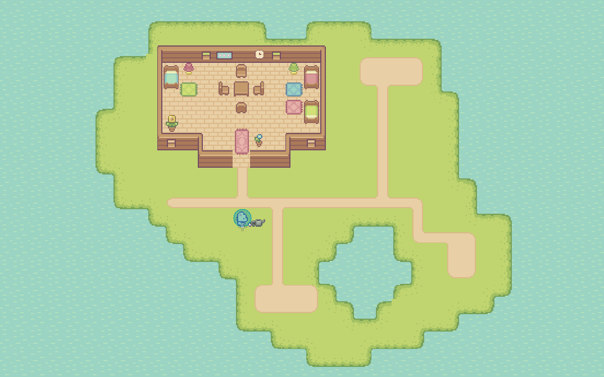
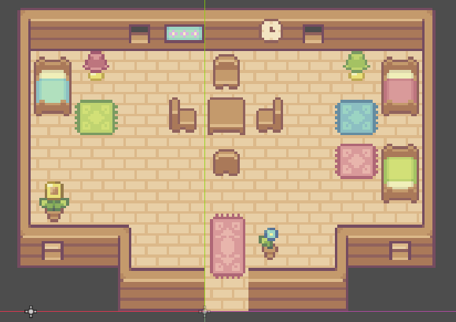

<p align="center">
  
</p>
<p align="center">
  <!-- Engine -->
  
  <!-- Language -->
  
  <!-- Status -->
  
  <!-- Platform -->
  
  <!-- License -->
  
</p>
---
 
## 🌿 About
 
**Farmland** is a 2D top-down farming game built with **Godot 4.3 + GDScript**, following the tutorial series *"How to Build a Complete 2D Farming Game"* by [Rapid Vectors](https://www.youtube.com/@rapidvectors).
 
The project follows a **Test Scene First** methodology — each system is built and tested independently before being integrated into the main world scene.
 
---
 
## 🎮 Screenshots
 
<table>
  <tr>
    <td align="center" width="50%">
      
      <sub><b>🌍 Exterior world</b> — grass, water, dirt paths and nature objects</sub>
    </td>
    <td align="center" width="50%">
      
      <sub><b>🏠 House interior</b> — full tilemap with furniture</sub>
    </td>
  </tr>
  <tr>
    <td align="center" width="50%">
      
      <sub><b>🧑‍🌾 Character spritesheet</b> — all movement & tool animations</sub>
    </td>
    <td align="center" width="50%">
      
      <sub><b>🌳 Nature assets</b> — trees, bushes, flowers and more</sub>
    </td>
  </tr>
</table>

---
 
## 🚜 Progress
 
 
| System | Feature | Status |
|---|---|:---:|
| 🗺️ **World** | Water tilemap layer | ✅ |
| 🗺️ **World** | Grass tilemap layer | ✅ |
| 🗺️ **World** | Dirt tilemap layer | ✅ |
| 🗺️ **World** | Nature objects (trees, rocks, flowers...) | ✅ |
| 🏠 **House** | Interior tilemap + furniture | ✅ |
| 🧑‍🌾 **Player** | Character + movement | ✅ |
| 🎭 **Player** | Walk & idle animations | ✅ |
| 💾 **Player** | Idle direction saved on state change | ✅ |
| ⛏️ **Player** | Chopping animation | ✅ |
| 💧 **Player** | Watering animation | ✅ |
| 🌱 **Player** | Tilling animation | ✅ |
| 🪓 **Tools** | Tool state system | 🔜 |
 
---
 
## 📁 Structure
 
```
farmland/
├── banner.svg
├── README.md
├── project.godot
├── assets/          # Sprites, tilesets, audio
├── scenes/
│   ├── test/        # Isolated test scenes per system
│   └── world/       # Main world scenes
└── scripts/         # GDScript (.gd)
```
 
---
 
## 🎨 Credits
 
### 🖼️ Art Assets
 
All visual assets are from the **Sprout Lands Asset Pack** by [**cupnooble**](https://cupnooble.itch.io/), used under their free distribution terms.
 
> 🌾 [**Sprout Lands – Asset Pack (Free version)**](https://cupnooble.itch.io/sprout-lands-asset-pack) — *cupnooble on itch.io*
 
Huge thanks to **cupnooble** for making these gorgeous pixel art assets freely available to the community! 🙏
 
### 🎓 Tutorial
 
> 📺 [**How to Build a Complete 2D Farming Game – All 25 Episodes · Godot 4.3**](https://www.youtube.com/watch?v=it0lsREGdmc)
> by [**Rapid Vectors**](https://www.youtube.com/@rapidvectors) on YouTube
 
---
 
## 🚀 Getting Started
 
**Requirements:** [Godot Engine 4.3+](https://godotengine.org/download)
 
```bash
git clone https://github.com/YOUR_USERNAME/farmland.git
# Open Godot → Import → select project.godot
```
 
---
 
<p align="center">
  <i>🌻 Made with love, GDScript and a lot of virtual soil 🌻</i>
</p>