<p align="center">
  
</p>
<p align="center">
  
  
  
  
</p>


## 🌿 About
 
**Farmland** is a 2D farming game built with **Godot 4.3**, developed following the tutorial series *"How to Build a Complete 2D Farming Game"* by [Rapid Vectors](https://www.youtube.com/@rapidvectors).
 
The project uses a **Test Scene First** approach — each system is built and tested in isolation before integrating into the main world.
 
---
 
## 🚜 Progress
 
| Feature | Status |
|---|---|
| 🌊 Water tilemap layer | ✅ Done |
| 🌱 Grass tilemap layer | ✅ Done |
| 🟫 Dirt tilemap layer | ✅ Done |
| 🌳 Nature objects | ✅ Done |
| 🧑‍🌾 Player character | ✅ Done |
| 🏃 Player movement | ✅ Done |
| 🎭 Player animations (walk + idle) | ✅ Done |
| 💾 Idle direction on state change | ✅ Done |
| 🪓 Tool states | 🔜 Next |
 
---
 
## 📁 Structure
 
```
farmland/
├── assets/          # Sprites, tilesets, audio
├── scenes/
│   ├── test/        # Isolated test scenes per system
│   └── world/       # Main world scenes
├── scripts/         # GDScript (.gd)
└── project.godot
```
 
---
 
## 🎨 Credits
 
### Art Assets
All visual assets are from the **Sprout Lands Asset Pack** by [**cupnooble**](https://cupnooble.itch.io/), used under their free distribution terms.
 
> 🌾 [Sprout Lands – Asset Pack (Free version)](https://cupnooble.itch.io/sprout-lands-asset-pack) — *cupnooble on itch.io*
 
Thank you to **cupnooble** for making these charming pixel art assets freely available! 🙏
 
### Tutorial
Built following:
 
> 📺 [**How to Build a Complete 2D Farming Game – Godot 4.3 · All 25 Episodes**](https://www.youtube.com/watch?v=it0lsREGdmc)
> by [**Rapid Vectors**](https://www.youtube.com/@rapidvectors) on YouTube
 
---
 
## 🚀 Getting Started
 
**Requirements:** [Godot Engine 4.3+](https://godotengine.org/download)
 
```bash
git clone https://github.com/YOUR_USERNAME/farmland.git
# Open Godot → Import → select project.godot
```
 
---
 
<p align="center">
  <i>🌻 Made with love, GDScript and a lot of virtual soil 🌻</i>